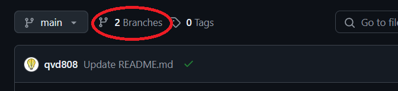
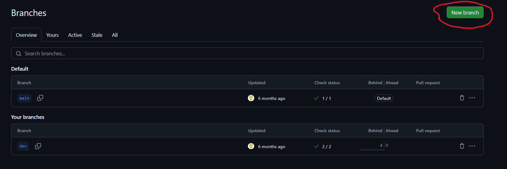

## Overview
This document describes the git workflow that should be used when pushing code to [project name]

- **Repository Hosting**: All code is stored on [GitHub](https://github.com/freeCodeCamp-2025-Summer-Hackathon/yellow-packet).

- **Branching Strategy**: We follow the _feature-branch_ model. For which:
  - `main` — stable production-ready branch. **Will reject any direct push request to the main branch**
  - Any developer that adding code to the project will be doing it through a feature branch, which will be describe in details below

## Workflows
### Git & Github
Developer will be assigned an issue to work on, when working on the new issue, developer should create a new branch from `main`. The new feature branch should be name after the issue they work on. For example, if you are working on improving the login page, the feature branch should be named `login-page-improve`. There are no general rules when it come to naming a branch as long as we understand what the branch will be doing.
You can create a branch by
- Going to your termnal and type (Note: For this to work, you need to be on the main branch, if you on another feature branch, the history will be from that branch)
```
git checkout -b feature-branch-name
```
- You can follow this step below to create a branch on GitHub




## Reference
- [Git workflow](https://github.com/asmeurer/git-workflow)
